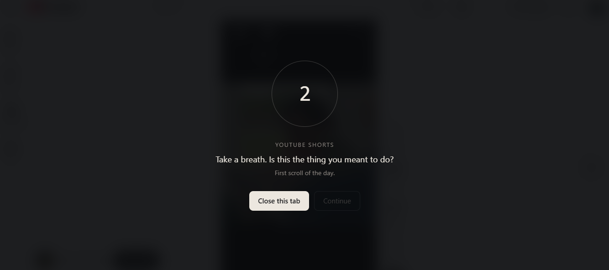
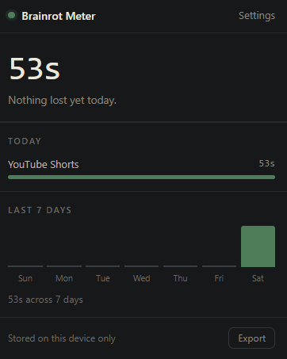

<div align="center">

# Rotmeter

**The internet, examined — and interrupted.**

Rotmeter is two things that argue with each other: a site that dives head-first into internet-culture *brainrot*, and a Chrome extension that puts a few deliberate seconds between you and the infinite feed. One makes the case. The other shows up at 11:40pm, when the case actually matters.

<br/>


&nbsp;&nbsp;


<br/><br/>

### [⬇️ Download the extension (.zip)](https://github.com/guru-bharadwaj20/Rotmeter/raw/main/brainrot-meter.zip)

**Unzip it**, then open `chrome://extensions`, turn on **Developer mode** (top right), and drag the unzipped **`brainrot-meter` folder** onto the page.

*Chrome loads unpacked extensions from a folder, not from a `.zip` — dropping the zip itself will fail. Works in Chrome, Edge, Brave and any other Chromium browser.*

</div>

---

## Background

Rotmeter began as **BrainROT**, a browser-based website I built together with my teammates as our **final deliverable for the PESU I/O course** — a multi-page React site exploring the quirks and curiosities of internet culture.

After the course wrapped, I carried the project further on my own. I took its own subject — attention, and the way infinite feeds quietly take it — and turned the argument into a tool, building the **Brainrot Meter** Chrome extension on top of the original site.

The extension adds:

- **A friction pause** — a short, enforced countdown before any infinite feed opens, with one deliberate click to continue and a one-tap "close this tab" instead.
- **Per-URL classification** — it distinguishes the endless surfaces from the intentional ones: YouTube Shorts but not a lecture, Reddit's front page but not the subreddit you chose to open.
- **A live dashboard** — today's total, a per-platform breakdown, and a 7-day trend, with a running time badge on the toolbar icon.
- **Goal-based cost framing** — name what the scrolling is taking from ("learn guitar"), and the pause reminds you of it by name.
- **Threshold check-ins** — a gentle reminder after a set number of feed-minutes in a day.
- **Idle-aware tracking** — time spent away from the keyboard isn't counted, so the numbers stay honest.
- **Private by design** — 100% local storage, no account and no network code, with JSON export and one-tap erase.

---

## What's inside

The project has two halves, each in its own folder.

### The site — [`website/`](website/)
A **React + Vite + Tailwind** experience that wanders the strange edges of internet culture: Deep Shower Thoughts, a live Meme Machine, Fandom Frenzy, and Strange Phobias. Underneath the humour it's an essay about algorithmic capture and the slow erosion of attention.

### 🧩 The extension — [`extension/`](extension/)
A **Manifest V3** Chrome extension that measures the time you actually lose to infinite feeds and interrupts the scroll with a short, chosen pause. No build step — load it unpacked and go.

- **The pause** *(left)* — before a feed opens, a countdown and one deliberate click. Enough friction to break the automatic reach, not enough to feel like a wall.
- **The dashboard** *(right)* — today's total, a per-platform breakdown, a 7-day trend, and one-tap JSON export.
- **The platforms** — YouTube Shorts, Instagram Reels, X / Twitter, Reddit's front page, Facebook, Snapchat Spotlight, Threads, Bluesky, Tumblr, Pinterest, Quora, 9GAG, ShareChat and Likee. Classification is **per-URL, not per-domain**: a lecture isn't brainrot, a Short is; r/cscareerquestions isn't, r/all is.
- **Local only** — no account, no server, and no network code anywhere in the extension. Your data never leaves the machine.

Full architecture and design notes live in [`extension/README.md`](extension/README.md).

---

## Why friction, not just tracking

Screen-time dashboards have famously poor retention — people install one, get scolded by a number, feel guilty, and uninstall. The evidence points elsewhere: the *one sec* study (PNAS, 2023) found roughly a third fewer app opens from a brief enforced pause. The mechanism is interrupting the automatic reach, not informing someone of a fact they already know.

So in Rotmeter the **pause is the product** and the dashboard is there to make it credible. The cost framing is personal and forward-looking: name your goal once, and the pause reads *"You said you wanted to learn guitar."* Same mechanic, far more teeth than "41 hours = 12 books."

---

## Setup

**The site**
```bash
cd website
npm install
npm run dev
```

**The extension**

No installation or build required. Either:

- **[Download the zip](https://github.com/guru-bharadwaj20/Rotmeter/raw/main/brainrot-meter.zip)**, unzip it, and drag the `brainrot-meter` folder onto `chrome://extensions` with **Developer mode** enabled — or
- Clone the repo and use **Load unpacked** → select the [`extension/`](extension/) folder.

---

## Project structure

```
Rotmeter/
├── website/              React + Vite site (the essay)
├── extension/            Chrome extension, MV3 (the intervention)
├── images/               Screenshots used in this README
├── brainrot-meter.zip    Packaged extension, for the download link above
└── README.md
```

---

## Disclaimer

Built for educational and portfolio purposes. All memes, fandom references, images, and text are used under fair-use guidelines; respective trademarks and copyrights belong to their rightful owners. The extension collects nothing and sends nothing — everything it records stays in your browser's local storage.

---

## License

Released under the [MIT License](LICENSE).